# Currency Watchlist & Alert Service

*Layered .NET backend, SQLite, a pluggable FX rate provider, and a plain-hooks React/TypeScript client — designed before any code is written.*

---

## Table of Contents

- [Overview](#overview)
- [Data Model](#data-model)
- [Backend Architecture](#backend-architecture)
- [API Contract](#api-contract)
- [Error Handling](#error-handling)
- [Request Flows](#request-flows)
- [Frontend](#frontend)
- [Screens & API Calls](#screens--api-calls)
- [Testing Strategy](#testing-strategy)
- [Environment Variables](#environment-variables)
- [Take-Home Diagram](#take-home-diagram)
- [Enterprise Diagram](#enterprise-diagram)
- [Decisions & Tradeoffs](#decisions--tradeoffs)

---

## Overview

**What this document covers, and how it's organized**

The assignment gives entities, endpoints, and grading weights, but leaves the internal design open. This spec fixes that design before implementation starts.

Three decisions were made up front and shape everything below: a full clean-architecture split on the backend (Api / Application / Domain / Infrastructure), TypeScript on the frontend, and plain hooks with a thin fetch wrapper instead of a data-fetching library — matching the assignment's own note that Redux-style state management isn't needed here.

**Reading order:** the sections from Data Model through the two required diagrams describe *what was built and how it works* — read them top to bottom for a clean technical picture, with just enough inline context to stand on their own. Every judgment call behind those choices — the "why this instead of that" — is deliberately kept out of that reading path and grouped together in **Decisions & Tradeoffs** at the end, organized by the same topics as the sections above it. Treat the two as a pair: the technical sections for how the system behaves, the decisions section for why it behaves that way.

---

## Data Model

**Entities and relationships**

Five entities, four of them chained by foreign key, one deliberately not.

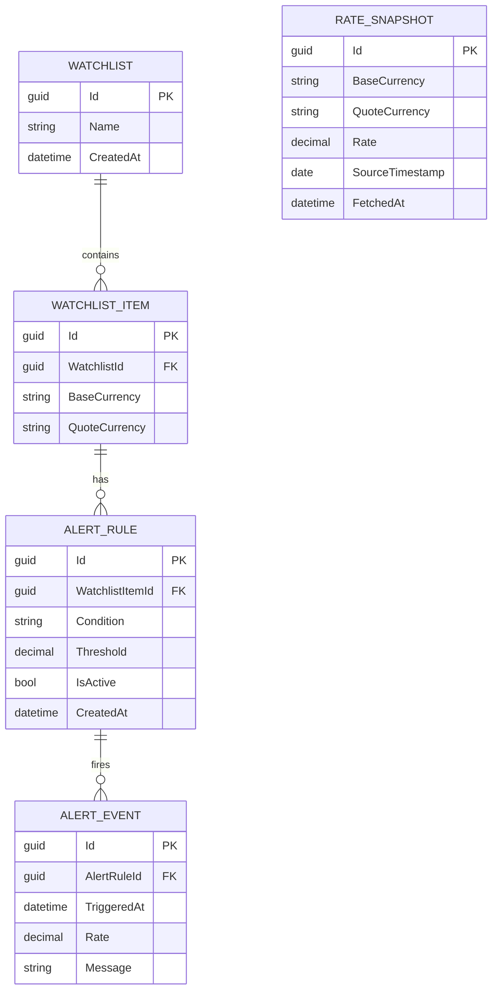

*RateSnapshot is intentionally disconnected from Watchlist — see below for what it's for.*

**Watchlist** is just a named container. **WatchlistItem** is one tracked currency pair inside a watchlist — a base and a quote currency, nothing else. **AlertRule** is a standing condition on one item ("notify me when this goes above X"). **AlertEvent** is a record of one actual trigger, not a log of every check — only the moments a rule fired, never the moments it didn't. **RateSnapshot** is the one entity with no foreign key at all: it's a cache of the latest fetched rate per currency pair, shared across every watchlist that happens to track the same pair, rather than something any single watchlist owns.

A few things about this shape are worth stating plainly rather than leaving implicit: `WatchlistItem` enforces a uniqueness constraint per watchlist so the same pair can't be added twice; deleting a `Watchlist` cascades all the way down through its items, rules, and events; `Above`/`Below` are strict inequalities (`>` / `<`), not inclusive; all rate and threshold arithmetic uses `decimal`, never `double`, end to end; and multiple alert rules on the same item are intentionally allowed — a two-sided "above X, below Y" pair of alerts is a legitimate setup, not a duplicate to reject. Full reasoning for each of these is under **Decisions & Tradeoffs → Data Model & Business Rules**.

RateSnapshot deserves a closer look on its own, since its purpose changed partway through this design (see **Decisions & Tradeoffs → Rate Data: Latest vs. History**): it used to be the sole source of rate history, and now it's purely a latest-rate cache. It wasn't eliminated even after that narrowing — it's still what `GET /api/rates/latest` and the watchlist-detail join read from, and what refresh and evaluate write into.

---

## Backend Architecture

**Four projects, one dependency direction**

Domain depends on nothing. Application depends on Domain. Infrastructure depends on both. Api is the composition root that wires interfaces to implementations at startup.

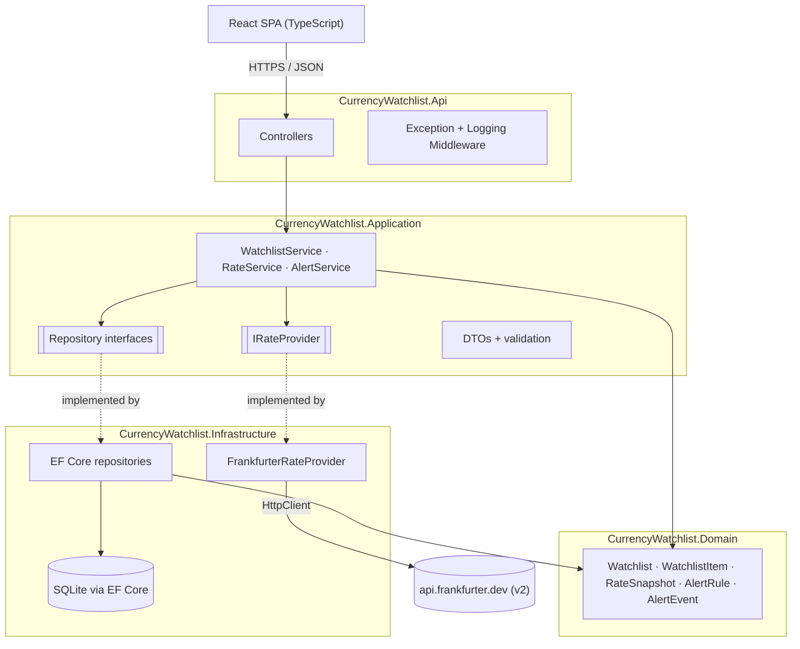

*Dotted arrows mark interface → implementation, wired in Api's Program.cs (the only place that knows Infrastructure exists). Four projects is more ceremony than a 6–10 hour build rewards on its own — see Decisions & Tradeoffs for why it's worth it here anyway.*

`FrankfurterRateProvider` targets `api.frankfurter.dev/v2` — verified directly against the live API, not the v1 URL shown literally in the brief (that URL still works, via redirect; see Decisions & Tradeoffs → External API Integration for the full comparison). `IRateProvider` exposes four methods: `GetLatestRateAsync` (single pair, used by evaluate), `GetLatestRatesAsync` (one base, many quotes — used by refresh), `GetHistoryAsync` (date range, used by the history endpoint), and `GetSupportedCurrenciesAsync` (the currency list, used by the dropdown and write-time validation).

### Currency list: cached in memory, not persisted

The currency list lives entirely in server memory via `IMemoryCache` — no database table. It's populated lazily, not on a schedule and not at startup: nothing is fetched until the first request that actually needs it, whether that's the dropdown or the validation check on adding a pair.

```csharp
public class FrankfurterRateProvider : IRateProvider
{
    private const string CurrenciesCacheKey = "frankfurter:supported-currencies";

    public async Task<IReadOnlyDictionary<string, string>> GetSupportedCurrenciesAsync(CancellationToken ct)
    {
        return await _cache.GetOrCreateAsync(CurrenciesCacheKey, async entry =>
        {
            entry.AbsoluteExpirationRelativeToNow = TimeSpan.FromHours(24);
            var response = await _http.GetFromJsonAsync<List<CurrencyDto>>("/v2/currencies", ct);
            return response.ToDictionary(c => c.IsoCode, c => c.Name);
        });
    }
}
```

Both call sites that need the list — `GET /api/currencies` and the write-time validation check in `WatchlistItemService` — share this one cached entry, so whichever runs first after a cold start warms it for the other. App starts with nothing cached → first request pays one live fetch and caches the result for 24 hours → every request in that window is an instant in-memory lookup → a restart wipes it back to nothing. Persisting this into its own database table was considered and rejected — see Decisions & Tradeoffs → External API Integration for the full cost/benefit reasoning.

### External call resilience and startup

Every outbound call to Frankfurter carries a bounded ~5-second `HttpClient` timeout and a single retry on transient failure — no Polly, no circuit breaker, at this scale (that machinery is exactly what the production diagram adds instead). Migrations auto-apply on startup (`db.Database.Migrate()`) rather than requiring a manual CLI step, and one sample watchlist is seeded on first run if the database is empty. CORS is one named policy scoped to the Vite dev origin, not `AllowAnyOrigin`. SQLite runs in WAL mode with a busy timeout configured on the connection. Reasoning for each of these is under Decisions & Tradeoffs → External API Integration.

### No Unit of Work, no explicit transactions

Deliberately absent from every layer above, not an oversight — both absences trace back to the same root cause: almost every write in this system is naturally a single atomic statement, and the one place with a genuine multi-step race, the fix was a different tool than either of these. Reasoning for both is under Decisions & Tradeoffs → External API Integration.

---

## API Contract

**Endpoints, payloads, status codes**

DTOs in, DTOs out — no EF entity ever crosses the controller boundary.

| Endpoint | Request | Response | Status |
|---|---|---|---|
| `POST /api/watchlists` | `{ name }` | `WatchlistDto` | `201` · `400` invalid name |
| `GET /api/watchlists` | — | `WatchlistDto[]` | `200` |
| `GET /api/watchlists/{id}` | — | `WatchlistDetailDto` (with items) | `200` · `404` |
| `DELETE /api/watchlists/{id}` | — | — | `204` · `404` |
| `POST /api/watchlists/{id}/items` | `{ baseCurrency, quoteCurrency }` | `WatchlistItemDto` | `201` · `400` bad/unsupported currency · `409` duplicate pair · `502` can't verify currency right now |
| `DELETE /api/watchlists/{id}/items/{itemId}` | — | — | `204` · `404` |
| `POST /api/rates/refresh` | — | `{ refreshed: RateSnapshotDto[], failed: { pair, reason }[] }` | `200` (partial failure still 200 — see decisions) |
| `GET /api/rates/latest?base=&quote=` | — | `RateSnapshotDto` | `200` · `404` no snapshot yet |
| `GET /api/rates/history?base=&quote=&from=&to=` | — | `RateSnapshotDto[]` — proxied live from the provider's time series, not read from local storage | `200` · `400` bad date range · `502` provider down |
| `GET /api/currencies` | — | `{ code, name }[]` | `200` |
| `POST /api/alerts` | `{ watchlistItemId, condition, threshold }` | `AlertRuleDto` | `201` · `400` |
| `GET /api/alerts?watchlistId=` | — | `AlertRuleDto[]` | `200` |
| `POST /api/alerts/{id}/evaluate` | — | `{ triggered, currentRate, threshold, condition, message, evaluatedAt }` | `200` · `404` · `502` provider down |

**Date-range rules for history:** `to` can't be in the future, `from` must be ≤ `to`, and the span is capped at a year so the live-proxied call and the resulting chart don't try to render an unbounded number of points. The chart defaults to the last 30 days before a user picks a custom range. `GET /api/currencies` is the one endpoint not in the original brief — added to back the currency dropdown; see Decisions & Tradeoffs → Error Handling & Observability for why it's a thin proxy rather than a new table.

---

## Error Handling

**One vocabulary across three layers**

Frankfurter, the backend, and the frontend each have a natural way to represent failure. Left alone, that's three uncoordinated schemes and a frontend that ends up saying "Something went wrong" for everything. The seams between them are designed on purpose below.

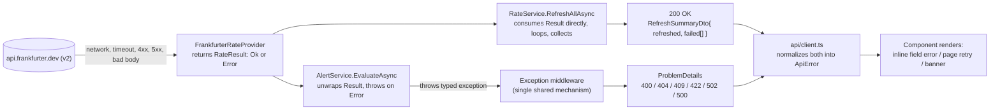

*The Result type is an internal detail of loop-based consumers. Single-call consumers unwrap it back into the shared exception vocabulary, so there's exactly one error-response mechanism at the HTTP boundary — not two. Full reasoning for the Result-vs-exception split is under Decisions & Tradeoffs.*

### Failure taxonomy

| Failure | Detected where | Represented as | HTTP status | Frontend treatment |
|---|---|---|---|---|
| Frankfurter unreachable / timeout / 5xx | `FrankfurterRateProvider` | `RateResult.Error(Unavailable)` | Evaluate: `502` · Refresh: entry in `failed[]`, still `200` · Add pair: `502` (can't verify the currency exists) | Inline banner: "Couldn't reach the exchange rate service — try again shortly" |
| Pair not recognized by provider (e.g. unsupported code) | `FrankfurterRateProvider` | `RateResult.Error(UnsupportedPair)` | Evaluate: `422` · Refresh: entry in `failed[]` | Inline banner naming the pair: "AUD→ZZZ isn't a supported currency pair" |
| Malformed/unexpected response body (provider contract drift) | `FrankfurterRateProvider` (deserialization) | Unhandled exception — a bug, not a modeled outcome | `500` | Generic error banner + trace ID; logged at Error for investigation |
| Malformed request shape (missing field, bad currency format) | DTO validation (data annotations / FluentValidation) | `ValidationProblemDetails`, automatic | `400` | Inline field-level error next to the offending input |
| `base == quote` pair submitted | Service-layer business rule | `ValidationException` | `400` | Inline field error on the currency pair form |
| Duplicate currency pair on the same watchlist | Service layer / DB unique constraint | `DuplicatePairException` | `409` | Inline: "This pair is already on this watchlist" |
| Watchlist / item / alert rule not found | Service layer | `NotFoundException` | `404` | Page-level not-found state, or a toast + list refresh if it disappeared mid-session |
| Unhandled server-side exception (a genuine bug) | Anywhere — caught by the top-level middleware | Generic `ProblemDetails`, full details logged server-side only | `500` | Page-level error state with a trace ID the user can report |
| Backend unreachable at all (down, CORS misconfigured, offline) | `api/client.ts` — `fetch` throws before any response | `ApiError{ status: null }` | — no HTTP response exists — | Distinct wording: "Can't reach the server — check your connection," never confused with a 502 |

Three failure origins — provider down (502), our own bug (500), request never arrived (network-level) — deliberately get three different messages rather than one generic banner. Log level follows whether a failure is *expected*, not its status code: `Warning` for anything the system is designed to hand back to a caller, `Error` (with full stack trace and trace ID) for outages and bugs, `Information` for milestone events regardless of outcome. Full reasoning under Decisions & Tradeoffs → Error Handling & Observability.

### The seam in practice: evaluate, when Frankfurter is down

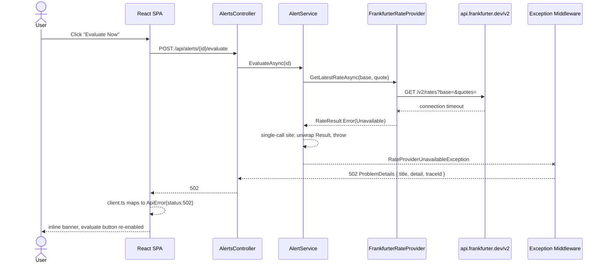

*Compare this to the refresh sequence diagram below: same underlying `RateResult.Error`, but refresh never reaches the middleware at all — it's collected into the 200 response's `failed[]` list instead.*

### Trace ID propagation

Every request gets one server-generated trace ID — ASP.NET Core's built-in `HttpContext.TraceIdentifier`, not a hand-rolled or client-issued correlation ID (why that distinction matters is under Decisions & Tradeoffs). It propagates through a logging *scope*, not a parameter threaded through every method signature — the latter would push an HTTP-specific concept down into Application and Infrastructure code that has no business knowing HTTP exists. One small piece of middleware in `Api` wraps each request:

```csharp
// Program.cs
app.Use(async (context, next) =>
{
    var traceId = context.TraceIdentifier;
    context.Response.Headers["X-Trace-Id"] = traceId;

    using (logger.BeginScope(new Dictionary<string, object> { ["TraceId"] = traceId }))
    {
        await next(context);
    }
});
```

Because it's a scope, every `ILogger` call made anywhere during that request — the controller, `AlertService`, deep inside `FrankfurterRateProvider` when the outbound call fails — automatically carries the same `TraceId` as a structured field, with no code in those layers ever handling a trace ID directly. It surfaces two ways: an `X-Trace-Id` header on every response, and inside the body as `ProblemDetails.Extensions["traceId"]` for errors. The frontend only *displays* it for `5xx` responses, never `4xx` — a 409 is already fixable from the message alone; a trace ID there is clutter.

> **Decision:** **The console logger needs `IncludeScopes` turned on explicitly, or none of this actually shows up anywhere.** `BeginScope` attaches the trace ID to the logging pipeline correctly regardless, but ASP.NET Core's default console logger doesn't print scope values unless told to — the design would be entirely correct and silently invisible in the terminal without this one line. Not a new dependency, not Serilog — just enabling what the built-in provider already supports:

```csharp
// Program.cs
builder.Logging.AddSimpleConsole(options => options.IncludeScopes = true);
```

> This is exactly the kind of gap worth catching before building rather than after: the trace-ID design reads as complete on paper — generate it, scope it, attach it to responses — but without this one line, the console output during a live demo would never actually show the ID next to the log line it's meant to help you find, which is the entire point of having it.

### Frontend error shape

Every hook (`useWatchlists`, `useWatchlistDetail`, `useAlerts`) exposes the same three fields, and every error — HTTP or network — gets normalized to one type before a component ever sees it:

```typescript
// api/client.ts
type ApiError = {
  status: number | null;              // null = request never reached the backend
  title: string;                      // from ProblemDetails.title, or a client-side default
  detail?: string;                    // from ProblemDetails.detail
  fieldErrors?: Record<string, string[]>;  // from ValidationProblemDetails.errors
  traceId?: string;                   // for 5xx — shown to the user, matched in server logs
};

// every hook returns:
{ data: T | null, loading: boolean, error: ApiError | null }
```

**Three UI treatments, chosen by where the error occurs**

- **Inline field errors** — form submissions. Read `fieldErrors` first, fall back to `detail`, render next to the relevant input.
- **Page-level retry state** — a full-page fetch fails (e.g. `GET /api/watchlists`). Replace the content area with the error and a Retry button, not a blank page or a silent stall.
- **Non-blocking banner** — action-triggered errors that shouldn't blank content already on screen: Refresh Rates partial failure, Evaluate Now hitting a 502. The existing table/list stays visible; the banner sits above it and dismisses on the next successful action.

Client-side validation (currency format, non-empty name, positive threshold) runs before submission purely to save a round trip — it's never trusted as the source of truth; the backend re-validates everything regardless.

---

## Request Flows

**Every endpoint, traced end to end**

Grouped by resource, in the same order as the API Contract table above, so the two can be cross-referenced directly. Simple reads stay simple; the two flows that actually touch the external API and branch the most — refresh and evaluate — get the fullest treatment.

### Watchlists

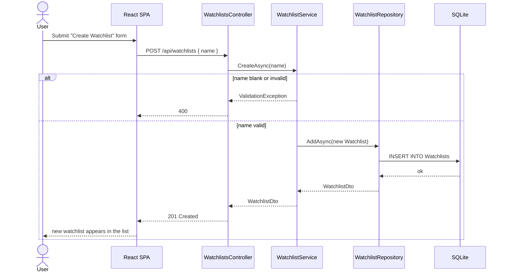

*`POST /api/watchlists` — the simplest write in the system: one validation branch, one insert.*

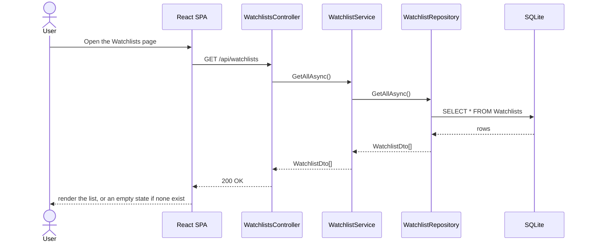

*`GET /api/watchlists` — no branching at all; the interesting part is entirely in what the frontend does with an empty result.*

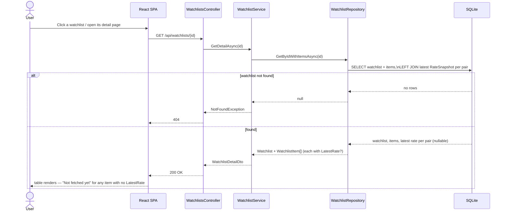

*`GET /api/watchlists/{id}` — the join that avoids an N+1 problem: one query fetches every item's latest rate at once, not one call per row.*

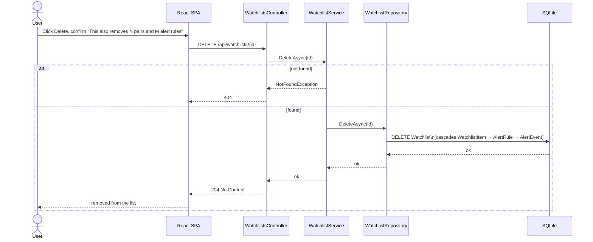

*`DELETE /api/watchlists/{id}` — one DELETE statement, four tables affected by cascade. The confirmation happens client-side, before this call is ever made.*

### Watchlist items

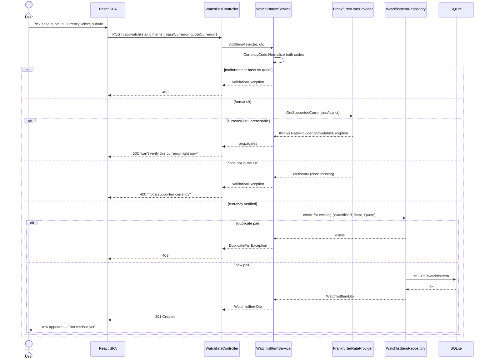

*`POST /api/watchlists/{id}/items` — the most heavily branched write in the system. Four independent failure paths, each mapped to a distinct status code; see Decisions & Tradeoffs → Currency Validation for why each branch exists.*

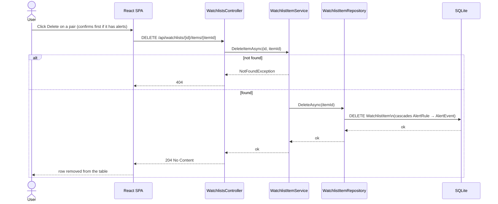

*`DELETE /api/watchlists/{id}/items/{itemId}` — the same cascade principle as deleting a whole watchlist, scoped one level down.*

### Rates

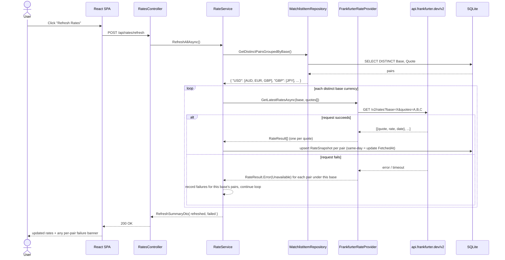

*One failed base currency doesn't fail the whole refresh — its pairs land in `failed[]` and the loop continues. Batching by base (not by pair) is the v2 migration's concrete payoff: a watchlist with 5 USD pairs costs one external call, not five.*

Three things make this safe under real-world conditions, each detailed in Decisions & Tradeoffs → Refresh Flow: there's deliberately **no per-pair fallback** when a batch fails, because write-time currency validation already stops a bad code from reaching the database in the first place; the per-base calls to Frankfurter run **concurrently** while the resulting database writes happen strictly **one at a time**, since `DbContext` isn't thread-safe; and the `RateSnapshot` upsert is a single **atomic SQL statement**, not a check-then-insert pattern, so two simultaneous refreshes (a double-click, two open tabs) can't race each other into a duplicate or a lost update.

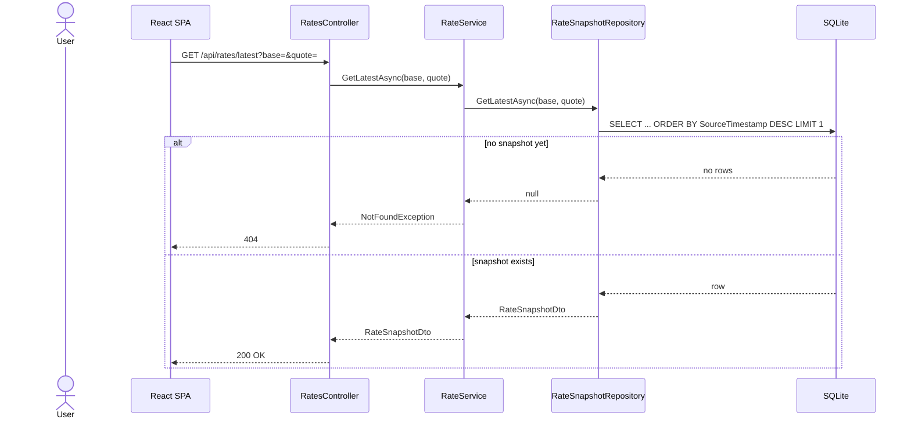

*`GET /api/rates/latest` — a pure cache read, never calls Frankfurter. Mostly exercised indirectly, via the watchlist-detail join above.*

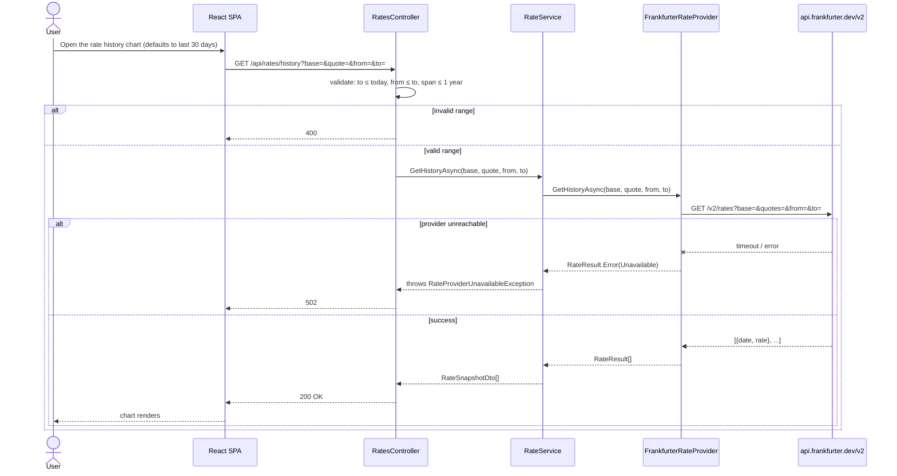

*`GET /api/rates/history` — proxies live, never touches `RateSnapshot`. The only read in the system whose availability is tied directly to Frankfurter's uptime at view time; see Decisions & Tradeoffs → Rate Data.*

### Currencies

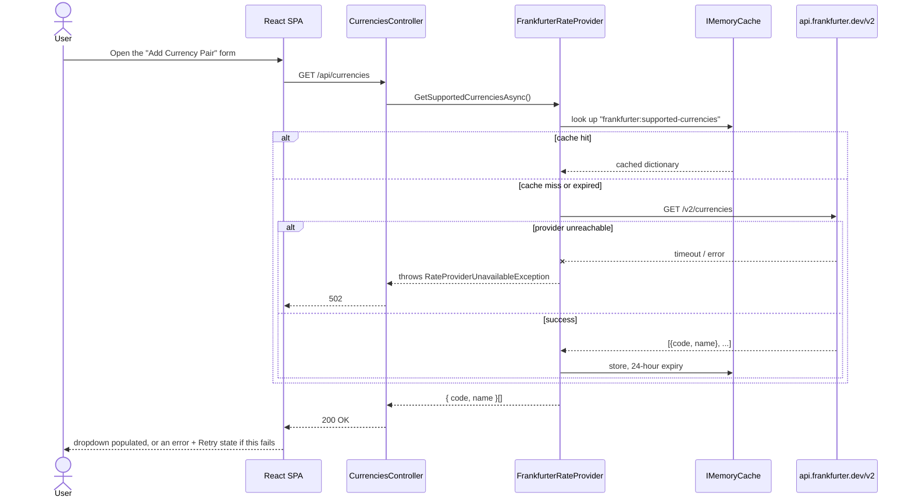

*`GET /api/currencies` — not in the original brief; the endpoint that turns free-text currency entry into a dropdown. See Decisions & Tradeoffs → External API Integration for the caching decision behind it.*

### Alerts

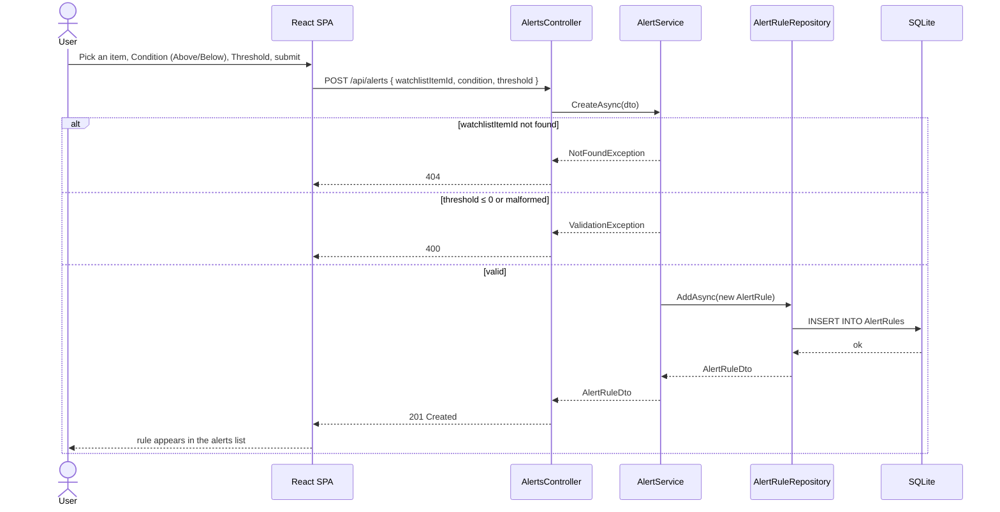

*`POST /api/alerts` — no restriction on multiple rules per item (see Decisions & Tradeoffs → Data Model & Business Rules); a second rule on the same pair is just another row.*

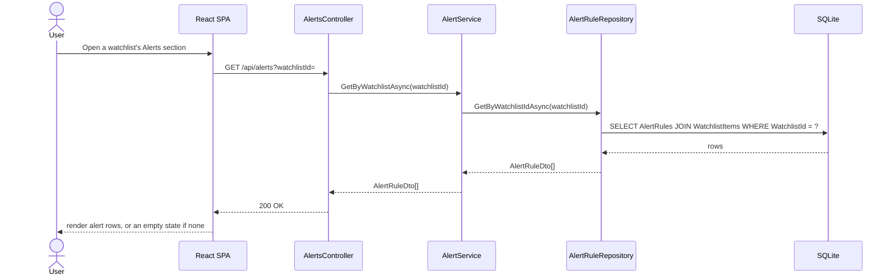

*`GET /api/alerts?watchlistId=` — a straight read; the interesting logic is entirely in evaluate, below.*

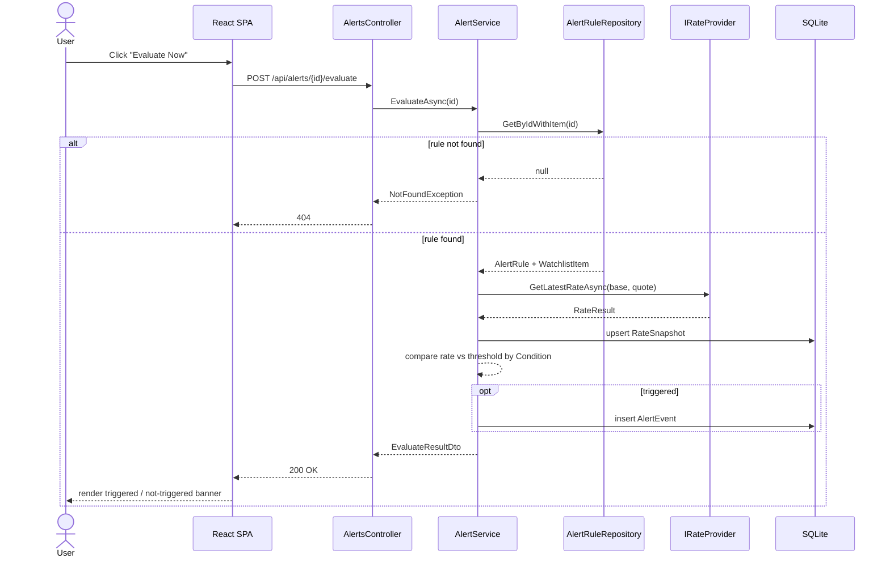

*Evaluate calls the live provider rather than reading the last snapshot, per the brief's own wording — see Decisions & Tradeoffs for the cost of that choice.*

---

## Frontend

**React + TypeScript, plain hooks**

No Redux, no React Query — a thin typed fetch wrapper and a handful of custom hooks that expose `{ data, loading, error }`, which is all three pages need.

```
src/
  api/
    client.ts            fetch wrapper: base URL, JSON parsing, error mapping
    watchlists.ts         typed calls: list, create, delete, getDetail
    rates.ts               refresh, latest, history
    alerts.ts               create, list, evaluate
    currencies.ts           list — calls OUR /api/currencies, never Frankfurter directly
  types/
    domain.ts              Watchlist, WatchlistItem, RateSnapshot, AlertRule, AlertEvent
  hooks/
    useWatchlists.ts       list + create + delete, {data,loading,error}
    useWatchlistDetail.ts  items + latest rates for one watchlist
    useAlerts.ts           create + list + evaluate
    useCurrencies.ts        fetch once, module-level cache — no React Query needed for one static list
  components/
    WatchlistCard.tsx
    CreateWatchlistForm.tsx
    CurrencyPairForm.tsx    renders two CurrencySelects
    CurrencySelect.tsx       dropdown from useCurrencies(); error + Retry state on fetch failure, no text-input fallback
    RateTable.tsx
    RateHistoryChart.tsx    small chart, recharts
    AlertForm.tsx
    AlertList.tsx
    EvaluateResultBanner.tsx
  pages/
    WatchlistsPage.tsx
    WatchlistDetailPage.tsx
  App.tsx                   two routes via react-router
```

A small chart library (Recharts) covers the "small chart visualization" requirement against `GET /api/rates/history` — a single line chart, not a dashboard. A never-refreshed pair shows "Not fetched yet — click Refresh Rates" rather than a blank cell or a 0.00, since a brand-new `WatchlistItem` has no matching `RateSnapshot` yet.

### Currency selection: a dropdown, not free text

Frankfurter's v1 API (ECB-only) covered roughly 30 currencies, not the ~180 that exist. The v2 API blends 84 central banks and exposes `GET /v2/currencies`, verified live to return 165 currencies with actual rate coverage.

`CurrencyPairForm` renders two `CurrencySelect` dropdowns, populated from that real list via our own `GET /api/currencies` — never calling Frankfurter directly from the browser, keeping the frontend's external-dependency surface at zero, consistent with every other part of this design. If that endpoint fails, `CurrencySelect` shows an error with a Retry button — it does not fall back to a free-text input. Currency entry is a dropdown or nothing; there's no path left where a human types a currency code by hand. Full reasoning — including why the dropdown removes an entire class of error, why the backend rejects rather than degrades, and why the text-input fallback was removed rather than kept — is under Decisions & Tradeoffs → Currency Validation.

### Where "Refresh Rates" lives

A tension baked into the brief itself, not something this design introduced: `POST /api/rates/refresh` refreshes rates "for all watchlist items" on a flat route with no `{watchlistId}` — a global action. But the required UI element for it is listed specifically under the Watchlist Detail Page, a view scoped to one watchlist.

The button stays on the Watchlist Detail Page (a named requirement, and where the "Not fetched yet" empty state already points) and is *additionally* placed at the top of the Watchlists list page as a convenience — the page that actually represents "everything." Both instances carry the same short caption stating their real scope. An accordion-based single-page redesign was considered as an alternative and rejected; see Decisions & Tradeoffs → Frontend & UX for both the placement reasoning and why the accordion didn't hold up.

Deleting a watchlist or item asks for confirmation first, naming what will be destroyed — see Decisions & Tradeoffs for why that's necessary given cascade delete.

---

## Screens & API Calls

**Which screen calls which API**

Two screens, thirteen endpoints — mapped explicitly so it's clear what each screen actually shows and does, not just what components exist. Every mutation below is followed by a re-fetch of the screen's own data (create/delete/refresh/evaluate, never optimistic updates — see Frontend), so that re-fetch isn't repeated as a separate row for each one.

### Watchlists Page — `/`

| What's on screen | Calls | Triggered by |
|---|---|---|
| The watchlist list itself | `GET /api/watchlists` | Page load |
| `CreateWatchlistForm` | `POST /api/watchlists` | Form submit |
| Delete action on a `WatchlistCard` | `DELETE /api/watchlists/{id}` | Delete button, after the "this also removes N pairs and M alerts" confirmation |
| "Refresh Rates" (the convenience placement) | `POST /api/rates/refresh` | Button click — see Decisions & Tradeoffs → Frontend & UX for why this button exists on this page at all |

### Watchlist Detail Page — `/watchlists/:id`

| What's on screen | Calls | Triggered by |
|---|---|---|
| The whole page — header, `RateTable`, alerts section | `GET /api/watchlists/{id}` | Page load, and again after every mutation below |
| The two `CurrencySelect` dropdowns in `CurrencyPairForm` | `GET /api/currencies` | First time any Add Currency Pair form mounts in the session — cached module-level after that (see Backend Architecture) |
| `CurrencyPairForm` submit | `POST /api/watchlists/{id}/items` | Add Currency Pair form submit |
| Delete action on a `RateTable` row | `DELETE /api/watchlists/{id}/items/{itemId}` | Delete icon, after confirmation if the pair has alert rules on it |
| "Refresh Rates" (the required placement) | `POST /api/rates/refresh` | Button click |
| `RateHistoryChart` | `GET /api/rates/history` | Expanding or selecting a pair row |
| `AlertForm` submit | `POST /api/alerts` | Create Alert Rule form submit |
| `AlertList` | `GET /api/alerts?watchlistId=` | Alerts section load, and again after creating a rule |
| "Evaluate Now" on a specific alert row | `POST /api/alerts/{id}/evaluate` | Button click on that row; result renders in `EvaluateResultBanner` for that row only |

> **Assumption:** **`GET /api/rates/latest` is not called by either screen — deliberately, not by omission.** It's a required endpoint in the brief and stays fully implemented, but this frontend never needs to call it directly: the watchlist-detail join already embeds each item's latest rate into `GET /api/watchlists/{id}`'s response (see the watchlist-detail sequence diagram in Request Flows), which is what avoids the N+1 problem of one `GET /api/rates/latest` call per row. The endpoint exists for direct API consumers — Swagger, curl, a future client that isn't this one — not because this UI needs it.

---

## Testing Strategy

**Where the >80% actually comes from**

A coverage number is a symptom, not a target — the point is testing the branching logic that actually exists in this design, not padding a percentage.

| Layer | What's covered | Tooling |
|---|---|---|
| Unit — `Application` services | `WatchlistService`, `RateService`, `AlertService` against strictly mocked repositories and `IRateProvider` — no real database connection or real HTTP call anywhere in this layer, by rule, not convenience. This is where the bulk of the coverage number and the actual branching logic both live: the Above/Below boundary condition, cascade-adjacent business rules, the Result-to-exception unwrap in `EvaluateAsync`, the batch-then-fallback-free refresh logic | xUnit + Moq + FluentAssertions |
| Integration | 2–3 true round trips through `WebApplicationFactory` against a real (temp file) SQLite database: create watchlist → add pair → refresh → read back; create alert → evaluate triggered vs. not-triggered. The database is real on purpose (verifies actual EF Core behavior a mock can't); Frankfurter itself is never called live — `RateProvider__BaseUrl` points at a local mock server, so the suite never depends on a live third party's uptime to pass. | xUnit + `WebApplicationFactory` |
| Frontend unit | Hooks' `{ data, loading, error }` contract, the validation rules module, `ErrorBanner`'s three variants rendering correctly per error shape | Vitest + React Testing Library |
| End-to-end | One full happy path: create watchlist → add pair via the dropdown → refresh → see a rate → create an alert → evaluate | Playwright |

Domain and Infrastructure are deliberately not where coverage effort concentrates — Domain is plain entities with nothing to branch on, and Infrastructure's repositories and `FrankfurterRateProvider` are thin wrappers whose correctness the integration tests already exercise indirectly against a real database and real HTTP responses.

---

## Environment Variables

**What needs to be configured, and why**

Five variables total, across both processes — kept deliberately small, with a reasoned default for every one that has a sensible default at all.

| Variable | Where | Default | Why it exists |
|---|---|---|---|
| `ASPNETCORE_ENVIRONMENT` | Backend | Unset falls back to a Production-like mode | A .NET convention, not something invented for this project — but it matters concretely here: it's what enables Swagger and detailed exception pages. Left unset, a reviewer running `dotnet run` would get neither, and the app would look less complete than it is. Set to `Development` for local running. |
| `ConnectionStrings__DefaultConnection` | Backend | `Data Source=watchlist.db`, in `appsettings.json` | Not required to be set manually — the default already works for `dotnet run`. Documented as the override point because integration tests (see Testing Strategy) point this at a separate temp-file database instead of the one the app itself seeds and uses. |
| `RateProvider__BaseUrl` | Backend | `https://api.frankfurter.dev`, in `appsettings.json` | Exists so `FrankfurterRateProvider`'s base URL isn't hardcoded in source. The concrete reason it matters: it's the override point for pointing integration tests at a local mock server instead of the real Frankfurter API, so tests don't depend on a live third-party service to pass. |
| `Cors__AllowedOrigin` | Backend | `http://localhost:5173`, in `appsettings.json` | The CORS policy (see Backend Architecture) needs to know the frontend's exact origin. Making it configurable rather than hardcoded in `Program.cs` means the frontend's dev port and the backend's allowed origin are one value kept in sync via config, not the same magic string duplicated in two codebases that could silently drift apart. |
| `VITE_API_BASE_URL` | Frontend (`.env`) | None — must be set | The one variable with no sensible built-in default, because the frontend genuinely has no way to know where the backend is running. Read via `import.meta.env.VITE_API_BASE_URL` in `api/client.ts` — the single place that knows the backend's address (see Frontend). Checked into `.env.development` as `http://localhost:5009` (avoiding 5000, which macOS's AirPlay Receiver occupies by default) so `npm run dev` works without any manual setup step. |

> **Assumption:** **What's deliberately absent is as informative as what's present.** No Frankfurter API key — the service requires no authentication at all, verified directly rather than assumed, so there's nothing to configure there. No database credentials — SQLite is a local file, not a networked service, so there's no username, password, or connection secret to manage the way a real Postgres deployment would need (see the enterprise diagram for where that reappears). No third-party configuration on the frontend at all — it never talks to Frankfurter directly (see Currency Validation), so it has no third-party surface to configure in the first place. And the currency-cache TTL, the ~5-second `HttpClient` timeout, and the single-retry policy are deliberately plain constants, not environment variables — they don't vary by environment at this scope, so making them configurable would be a knob nobody would ever actually turn.

---

## Take-Home Diagram

**System diagram — this take-home**

Everything runs as two local processes talking over HTTP, plus one outbound call to a public API.

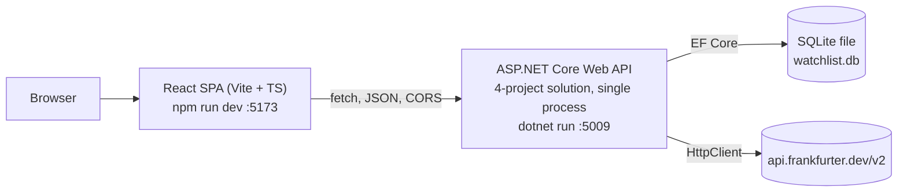

*No auth, no queue, no cache — a single developer machine, matching the assignment's scope.*

---

## Enterprise Diagram

**System diagram — production / enterprise**

Same domain model, but rate polling becomes event-driven, alert notification becomes its own decoupled service, and every single point of failure in the take-home version gets a reason to exist here.

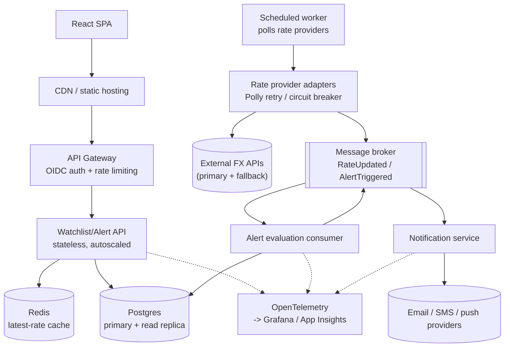

*The manual "Refresh Rates" and "Evaluate Now" buttons disappear — polling and evaluation become background events, and the UI just displays state.*

**What changed, and why**

- **SQLite → Postgres** — concurrent writes from a scheduler and multiple API instances need real row-level locking.
- **Manual refresh → scheduled worker + message bus** — alerts should fire within seconds of a rate move, not when a user happens to click a button.
- **Redis cache** — evaluation and dashboard reads shouldn't hit Postgres or the FX provider on every request.
- **Notification service, decoupled via the bus** — email/SMS/push has its own failure modes and retry semantics; it shouldn't block alert evaluation.
- **Multiple provider adapters + Polly** — `IRateProvider` already isolates this; production adds retry, circuit-breaking, and a fallback provider behind the same interface.
- **Gateway + OIDC** — the take-home has no concept of a user; a real service needs tenancy and auth before "my watchlist" means anything.
- **Observability** — distributed tracing across API → bus → consumer is the only way to debug why an alert didn't fire.

---

## Decisions & Tradeoffs

**Every judgment call, grouped by topic**

The technical sections above describe what this system does. This section is entirely about why — every decision, tradeoff, and assumption made along the way, organized to match the sections that reference them, so nothing is left implicit and nothing has to be found by scrolling through unrelated topics.

### Data Model & Business Rules

*Referenced from: Data Model*

> **Decision:** RateSnapshot has no WatchlistId, matching the schema given in the brief. Two watchlists both tracking USD→AUD share the same cached row rather than duplicating it. A unique index on `(BaseCurrency, QuoteCurrency, SourceTimestamp)` keeps a refresh idempotent — re-running it the same day updates `FetchedAt` on the existing row instead of inserting a duplicate.

> **Decision:** A unique constraint on `WatchlistItem(WatchlistId, BaseCurrency, QuoteCurrency)` stops the same pair being added twice to one watchlist — not stated in the brief, but a silent duplicate-pair bug is worse than a 409 on a repeat POST.

> **Decision:** **Delete cascades all the way down.** Deleting a `Watchlist` deletes its `WatchlistItem`s, which deletes their `AlertRule`s, which deletes their `AlertEvent`s — configured as `OnDelete(DeleteBehavior.Cascade)` on each relationship in `AppDbContext`. This matters because the required API surface has no way to delete an `AlertRule` on its own — the only listed alert endpoints are create, list, and evaluate. Without cascading, deleting a `WatchlistItem` that has an alert on it would either throw a foreign-key violation or leave an orphaned rule with no item to point at and no endpoint to clean it up.

> **Decision:** **Above/Below are strict inequalities — `rate > threshold` and `rate < threshold` — never `>=`/`<=`.** "Goes above 1.60" describes crossing past a level, not touching it; a rate sitting exactly at the threshold hasn't gone above it. The two conditions deliberately share one exact value — the threshold itself — where neither fires, which is correct behavior for two open-ended conditions, not an edge case needing a special rule. Worth a dedicated unit test asserting `rate == threshold → not triggered`, since it's precisely the kind of subtle rule a reviewer might test directly at the boundary.

> **Decision:** **All rate and threshold arithmetic is `decimal`, never `double`, end to end.** From Frankfurter's JSON response, through `RateResult`, through `RateSnapshot.Rate` and `AlertRule.Threshold`, to the comparison inside `AlertService` — a single silent `double` anywhere in that chain reintroduces floating-point comparison artifacts in exactly the code path that decides whether an alert fires.

> **Assumption:** **Multiple `AlertRule`s on the same `WatchlistItem` are allowed, not restricted.** Nothing enforces uniqueness on `WatchlistItemId` in `AlertRule` — a user creating both "Above 1.60" and "Below 1.50" on the same pair (a two-sided alert) is a legitimate use case, not a duplicate to reject.

### Rate Data: Latest vs. History

*Referenced from: Data Model, Error Handling*

> **Decision:** **AlertEvent is written only when a rule actually triggers** — a call to `POST /api/alerts/{id}/evaluate` that finds the condition false returns that result to the caller but inserts nothing. Two reasons: first, the given schema (`Id, AlertRuleId, TriggeredAt, Rate, Message`) has no `WasTriggered` flag — every field name assumes a row *is* a trigger. Second, nothing is lost by skipping it: Frankfurter's own historical data (proxied live via `GET /api/rates/history`) makes "why didn't this fire" reconstructable after the fact for *any* past date — not just one where a manual refresh happened to run that day. Logging every non-trigger would just be duplicating that history from a second angle, for rows that are mostly noise.

> **Decision:** **RateSnapshot's role narrowed after migrating to Frankfurter's v2 API. It originally accumulated day-by-day as the sole source of rate history; now it's purely a latest-rate cache** — what powers `GET /api/rates/latest` and the watchlist-detail join without hitting the external API on every page load. `GET /api/rates/history` no longer reads it at all; v2 exposes a native date-range time series, so history is proxied live instead of depending on how many times "Refresh Rates" happened to be clicked in the past.
>
> **This is a narrowing, not an elimination — the table stays, on three grounds.** It's a named, required entity in the brief's own Core Entities list, not something invented for this design to later remove at will. Functionally, `GET /api/rates/latest` and the watchlist-detail join still need a way to answer "what's the latest rate" without a live call on every page view, and refresh/evaluate still write into it as a side effect of fetching live. And without it, "Refresh Rates" would stop meaning anything — if reads were always live anyway, there'd be nothing left for the button to actually update.

> **Tradeoff:** **`GET /api/rates/history` proxies live to Frankfurter's v2 time-series endpoint instead of reading locally accumulated `RateSnapshot` rows.** The upside is real: a pair added five minutes ago shows a genuine multi-day chart immediately, rather than a flat line until enough manual refreshes accumulate. The cost is real too — the history endpoint's availability is now tied to Frankfurter's uptime at the moment someone views the chart, not just at refresh time; if the provider is down, the chart fails with a `502` rather than showing whatever was locally cached. Chosen deliberately: for a system whose whole purpose is displaying rate history, richer data immediately outweighs surviving a provider outage that `RateSnapshot`-as-cache still protects `/api/rates/latest` against regardless.

> **Tradeoff:** Evaluate calls the live provider instead of trusting the last snapshot, since the brief says the endpoint should "fetch latest rate." That's an extra external call per evaluation — acceptable at this scale, and it's exactly the call a Redis cache would absorb in the production version.

### External API Integration

*Referenced from: Backend Architecture*

> **Tradeoff:** Four projects is more ceremony than a 6–10 hour budget rewards on its own — it earns its keep by making the Controller → Service → Repository separation structural rather than a naming convention, which is what the design criterion is actually checking for. If time runs short, Domain and Application can collapse into one project without changing any of the diagrams above.

> **Decision:** **`FrankfurterRateProvider` targets `api.frankfurter.dev/v2`, not the v1 URL shown literally in the brief.** Verified directly against the live API before deciding this, not assumed: the brief's exact example (`api.frankfurter.app/latest?from=USD&to=AUD`) still works today — it 301-redirects through to v1 on the new domain — so nothing in the brief is contradicted by moving to v2. v2 gives three concrete things v1 doesn't: 165 currencies with real rate coverage instead of ~30 ECB-only ones, the ability to batch every quote for a given base into one call instead of one call per pair, and trustworthy structured errors — a confirmed `422 {"status":422,"message":"invalid currency: ZZZ"}` for a bad code, versus v1's bare `404 {"message":"not found"}`.

> **Decision:** **The currency list is cached in memory, deliberately not persisted to a database table.** Considered explicitly, not defaulted into.

| Claimed benefit of persisting | Why it doesn't hold up here |
|---|---|
| Avoid repeated calls to Frankfurter | Already solved — a 24-hour in-memory TTL does this with zero schema |
| Survive an app restart without an empty cache | True, but costs one ~200ms fetch on the next request after a restart — not a real problem at this scale |
| Resilience if Frankfurter is down when the cache expires | Not masked — the dropdown shows an error with Retry, and adding a pair fails with a 502, consistently, on both the read and write side (see Currency Validation) |
| SQL joins / reporting on currency metadata | Nothing in this app needs that — the only consumer is a dropdown |

> **The app's actual solidity rests on rate data, not the currency reference list, and rate data is already persisted.** `RateSnapshot` — the thing the whole app exists to track — is already persisted, cached, batched, and covered by the full error taxonomy. The currency list is a much smaller, secondary piece: a dropdown convenience plus one extra validation gate. Walking through "Frankfurter goes down for an hour": viewing an existing rate still works (served from `RateSnapshot`), refresh fails gracefully for that cycle only, and adding a new pair correctly fails with a 502 until the outage clears — deliberately not degraded, since silently accepting an unverified currency is worse than a temporary block (see Currency Validation for why this specific path chose correctness over availability). Persisting it would add a table, a migration, and mirror-and-reconcile logic (insert what's new, soft-deactivate what Frankfurter stopped listing, never hard-delete or foreign-key it to `WatchlistItem` — an upstream list shrinking should never cascade into deleting a user's data) for benefits that don't bite at this scale. It would also be the first piece of "keep local data in sync with upstream" infrastructure in a build that otherwise has none — every other automated-vs-manual question here (refresh, evaluate) was deliberately answered "a manual button," with polling pushed entirely into the production diagram.
>
> The one place in this design that actually *is* exposed to a sustained Frankfurter outage is `GET /api/rates/history` (see Rate Data above) — that's the higher-leverage target for resilience effort, not the currency list.

> **Decision:** **A bounded ~5-second `HttpClient` timeout and a single retry on transient failure — no Polly, no circuit breaker, at this scale.** That resilience machinery is exactly what the production diagram adds ("Rate provider adapters, Polly retry / circuit breaker") — building it here would duplicate, at small scale, infrastructure this design already places deliberately in the production version.

> **Decision:** **Migrations auto-apply on startup** (`db.Database.Migrate()` early in `Program.cs`) rather than requiring a manual `dotnet ef database update` step. Whoever's reviewing this should be able to `dotnet run` and have it work. This is explicitly a take-home convenience, not a production pattern — a real deployment would never want the app process itself auto-migrating on every boot, since multiple instances starting simultaneously could race, and a bad migration should be a controlled, revertable deploy step. The migration files themselves are still authored at development time via the `dotnet-ef` CLI and committed to the repo; auto-apply only means the app runs whatever's already there.

> **Decision:** **One sample watchlist is seeded on first startup if the database is empty** — "Travel Fund" with USD→AUD and USD→EUR, deliberately with no `RateSnapshot` and no `AlertRule`. A reviewer's first load otherwise shows a completely empty app. Seeding without a snapshot means the first thing they see is the "Not fetched yet — click Refresh Rates" empty state already designed, rather than a blank list — and it means startup never depends on Frankfurter being reachable.

> **Decision:** **CORS is one named policy scoped to the Vite dev origin, not `AllowAnyOrigin`.** The frontend and backend run as two separate local processes on different ports; an explicit, narrow policy is the same amount of setup as a permissive one and doesn't leave a wildcard sitting in the code as a habit that could carry over into something less throwaway.

> **Decision:** **SQLite runs in WAL mode with a busy timeout configured on the connection — a different failure mode than the one solved by the atomic upsert (see Refresh Flow).** The atomic upsert fixes a *logical* race on one specific row. It doesn't fix SQLite's more basic behavior: by default, a write locks the whole file, and a concurrent read or write during that window can throw "database is locked" rather than just waiting. `PRAGMA journal_mode=WAL` lets reads continue while a write is in progress; a busy timeout of a few seconds means a momentary lock contention waits briefly instead of failing immediately. These two settings pair naturally with the upsert work — one closes a logical race, the other closes an infrastructure-level one.

> **Decision:** **No `IUnitOfWork` abstraction anywhere in this design — `DbContext` already is one.** The reason to build a Unit of Work is to coordinate writes across multiple repositories so they commit or roll back together as a single operation. EF Core's `DbContext` already does exactly that natively: every repository in this design (`WatchlistRepository`, `WatchlistItemRepository`, `AlertRuleRepository`) is constructed with the same scoped `DbContext` instance, since ASP.NET Core registers it Scoped — one per HTTP request. A service method that touches two repositories and then calls `SaveChangesAsync()` once already commits both changes together as one transaction, automatically. Wrapping that in a hand-rolled `IUnitOfWork` with its own `Commit()` method would be the same mistake as building a generic `IRepository<T>` on top of `DbSet<T>` — a layer over something the framework already provides, adding ceremony instead of capability.

> **Decision:** **No explicit database transactions anywhere either — because the actual race conditions in this system couldn't have been solved by one.** The two genuine races already covered above — the `WatchlistItem` duplicate check and the `RateSnapshot` upsert — both looked at first like transaction candidates ("wrap the check-and-insert in a transaction"), but a transaction wrapping a check-then-act sequence doesn't actually prevent two concurrent requests from both reading "not found" before either commits, at SQLite's default isolation level. A transaction groups statements; it doesn't stop two separate transactions from racing each other. The real fix in both cases was making the operation a single atomic statement instead — `INSERT ... ON CONFLICT DO UPDATE`, or "attempt the insert, let the unique index be the arbiter, catch the violation" — which sidesteps the need for a transaction rather than needing one wrapped around it. Beyond those two, almost every write in this domain really is just one statement: creating a watchlist, adding an item, and deleting a watchlist (whose cascade fan-out happens at the database's foreign-key level, not as separate application-level writes) are each a single `INSERT` or `DELETE`. There was never a "step one must succeed before step two is safe to attempt" shape anywhere in this domain — the shape transactions actually exist to protect.

> **Tradeoff:** **One honest exception, named rather than glossed over: evaluate's two writes aren't wrapped in a transaction, and they could theoretically fall out of sync.** Evaluate upserts `RateSnapshot` and then, if the rule triggered, inserts `AlertEvent` — two related writes in one request. Because the `RateSnapshot` upsert is raw SQL executed immediately rather than an EF Core change-tracked entity deferred to `SaveChangesAsync()`, the two writes aren't automatically bundled into one transaction the way two ordinarily-tracked changes would be. If the snapshot write succeeds and the event insert then fails, the cache ends up updated but the trigger goes unrecorded. This is accepted rather than fixed with new machinery, because it's narrow and self-healing: a failed `AlertEvent` insert propagates as a real error to the caller, not a silent swallow, and clicking Evaluate again simply re-fetches, re-upserts (harmlessly, since it's idempotent), and retries the event insert fresh. A real gap, worth stating plainly — not one worth building a transaction for.

### Currency Validation

*Referenced from: Frontend, Key Flows*

> **Decision:** **`CurrencyPairForm` renders two `CurrencySelect` dropdowns, populated from a real currency list, instead of free-text 3-letter inputs.** This doesn't just improve the UX — it removes an entire class of error before it can happen. A user can't type `PKR` or `aud` with stray whitespace if the only options presented are the ones that actually exist; the casing/whitespace normalization problem and the "well-formed but unsupported" problem both stop being things a normal user ever encounters.

> **Decision:** **The dropdown is populated from `GET /api/currencies` — our own backend — not from Frankfurter's endpoint directly.** Every other design decision in this document routes third-party awareness through `IRateProvider`/`Infrastructure` exclusively; the frontend has never talked to Frankfurter and shouldn't start now just for this. `FrankfurterRateProvider` implements `GetSupportedCurrenciesAsync()` against Frankfurter's `/currencies` endpoint, wrapped in a long-TTL in-memory cache; a small `CurrenciesController` exposes it as `GET /api/currencies`.

> **Tradeoff:** The form now depends on `/api/currencies` succeeding to even *render* — `CurrencySelect` shows a loading state while it fetches and, if it fails, shows an error with a Retry button, not an editable input. Adding a new pair is simply unavailable while the currency list can't be loaded, on both the read side (dropdown) and the write side (submission). No degraded middle ground remains.

> **Decision:** **The text-input fallback was removed from `CurrencySelect` entirely, once the backend stopped accepting unverified currencies — keeping it would have been an inconsistency, not a convenience.** Before the backend's fail-closed reversal (above), the text input at least gave someone a chance of success during a Frankfurter outage. After that reversal, it doesn't: the same outage that breaks `GET /api/currencies` almost always breaks the backend's own verification check too, so a form that degrades to "still let them type something" was, in practice, just letting someone fill out a form that was already going to fail at submission with a 502. Keeping a functional-looking text input that leads to a near-certain rejection is worse than an honest error state up front — it wastes the user's effort typing a code that was never going to be accepted, instead of telling them immediately that adding a pair isn't possible right now. Currency entry is now a dropdown or nothing, on both the frontend and the backend, for the same reason: nothing gets accepted without going through the real currency list.

> **Decision:** **The `base == quote` guard is load-bearing on v2, not just a fast-fail convenience.** Verified directly: v1 already rejected `USD→USD` server-side (`422 "bad currency pair"`), but v2 does not — it returns `200` with rate `1.0`, since taken literally that's a correct answer. Migrating to v2 means the client- and service-layer guard is now the *only* thing stopping a nonsensical same-currency pair from being accepted.

> **Decision:** **Currency codes are uppercased at the boundary** — in DTO validation on the backend and on blur in the frontend form — before they're ever compared or stored. Without this, `usd/AUD` and `USD/AUD` would be treated as different pairs: the `WatchlistItem` uniqueness constraint wouldn't catch the duplicate, and refresh would fetch and cache the same rate twice under two different keys.

> **Decision:** **Backend currency validation is two layers, both at write time, and both must pass — not format-only, and not degrade-on-failure, superseding two earlier versions of this decision.** Layer one: `CurrencyCode.Normalize`, the `^[A-Z]{3}$` check, cheap and always run first. Layer two: a membership check against the same cached currency list that backs the dropdown — this is what actually closes the gap, rejecting a well-formed but fake code like `ZZZ` at `POST /api/watchlists/{id}/items` with a `400`, for *both* the dropdown and a caller bypassing it (Swagger, curl). No static whitelist is owned or maintained — the list is the same live-fetched, 24-hour-cached data already described above.

```csharp
private async Task<bool> IsSupportedAsync(string code, CancellationToken ct)
{
    var supported = await _rateProvider.GetSupportedCurrenciesAsync(ct);
    // no try/catch here — if the list can't be fetched, this throws
    // RateProviderUnavailableException and propagates to the middleware as a 502.
    // A currency that can't be verified is treated as not verified, not as accepted.
    return supported.ContainsKey(code);
}
```

> **Tradeoff:** **Correctness over availability, on purpose — this reverses an earlier version of the decision that degraded to format-only when the currency list was unreachable.** That earlier version accepted an unverified code during a Frankfurter outage, reasoning that a third-party outage shouldn't block adding a pair. The cost was real: a bad currency could slip into the database in that window, sit there looking identical to a valid, not-yet-refreshed pair, and only surface as wrong the next time someone happened to click Refresh or Evaluate on it — invalid records reachable through a legitimate flow. That tradeoff was rejected. If the currency list can't be verified, `POST /api/watchlists/{id}/items` now fails outright with a `502` ("can't verify this currency right now — try again shortly") instead of accepting the pair unchecked. The cost is symmetrical and explicit: you cannot add a *new* pair while Frankfurter is unreachable, full stop — but nothing invalid can ever reach the database because it couldn't be verified. Existing pairs and their cached rates are entirely unaffected, since this check only runs at creation time.

### Refresh Flow

*Referenced from: Key Flows, API Contract*

> **Decision:** `POST /api/rates/refresh` is global — it refreshes every distinct currency pair across all watchlists, not just one. That matches the endpoint's literal shape (no `watchlistId` in the route) and avoids fetching the same pair twice when two watchlists share it.

> **Decision:** **No per-pair fallback when a batched base-currency call fails — considered, then dropped once write-time validation existed to make it unnecessary.** A single bad currency under a base fails that base's *entire* batch on v2, which initially argued for a fallback: retry the base's quotes one-by-one so a bad sibling doesn't take down valid ones. But that fallback only protected against a bad currency already sitting in `WatchlistItem` — and write-time validation now rejects rather than degrades (see Currency Validation above), so a bad code can never reach the database at all, not even in a narrow outage window. Building refresh-time recovery for a scenario that can no longer occur would be solving an already-closed problem. Genuine provider unavailability (timeouts, 5xx) is unaffected by any of this either way — falling back to individual calls wouldn't help there, since every pair under that base is equally unreachable.

> **Decision:** **Fetch concurrently, write sequentially — never the reverse.** The per-base calls to Frankfurter are independent I/O with no shared state, so `RefreshAllAsync` fires them together via `Task.WhenAll` rather than looping one at a time — total refresh time becomes roughly the slowest single call, not the sum of every base. But the DB write phase happens afterward, strictly one upsert at a time, against the single request-scoped `DbContext`, which is not thread-safe. The pattern is fetch-in-parallel-collect-in-memory, then write-serially.
>
> **Each write in that sequential loop is independently fault-isolated — one failed upsert doesn't abort the rest of the loop.** By the time the write phase runs, every pair in it already succeeded at the fetch stage; a transient DB problem on one pair (lock contention outlasting the busy timeout, say) has nothing to do with the others. A try/catch around each individual upsert, not one wrapping the whole loop, means a pair that fails to *persist* lands in `failed[]` exactly like a pair that failed to *fetch* — same response shape, same frontend treatment — rather than that one write failure silently discarding every other already-fetched, perfectly good result still waiting to be saved.

```
foreach (var result in fetchedResults)
{
    try
    {
        await UpsertRateSnapshotAsync(result); // the atomic ON CONFLICT DO UPDATE statement
        refreshed.Add(result);
    }
    catch (Exception ex)
    {
        _logger.LogError(ex, "Failed to persist rate for {Base}/{Quote}", result.Base, result.Quote);
        failed.Add(new FailedPair(result.Base, result.Quote, "Could not save this rate"));
    }
}
```

> **Decision:** **The `RateSnapshot` upsert is one atomic SQL statement, not a check-then-insert pattern in C#.** Two refresh requests racing on the same `(BaseCurrency, QuoteCurrency, SourceTimestamp)` key — a double-clicked button, two open tabs — is a genuine race if written as "query for an existing row, then decide whether to insert or update": both requests can see "no row yet" before either one commits. SQLite supports `INSERT ... ON CONFLICT(...) DO UPDATE` natively, so the upsert is expressed as a single indivisible statement instead.

> **Tradeoff:** A partially-failed refresh returns `200` with a `failed[]` list rather than a `207` or a thrown error — simpler for the frontend to render ("3 of 4 pairs updated") than branching on an unusual status code for a take-home-scale client.

### Error Handling & Observability

*Referenced from: Error Handling, API Contract*

> **Decision:** **`IRateProvider` returns a Result, not an exception** — `Task<RateResult>` where `RateResult` is either a success or one of two typed failures: `Unavailable` or `UnsupportedPair`. This is specifically because `RefreshAllAsync` loops over every distinct pair and must keep going after one fails — checking `result.IsSuccess` in a loop reads cleanly; wrapping every iteration in try/catch does not. Every other exception type in the system stays a thrown exception, because those call sites are single-outcome, not loops.

> **Decision:** **Three failure origins get three different messages, on purpose.** A `502` ("our backend is fine, Frankfurter isn't"), a `500` ("our backend has a bug"), and a network-level failure ("your request never reached our backend") are diagnostically different situations, and collapsing them into one generic banner would hide which one a user is actually looking at.

> **Decision:** **Log level follows whether the failure is expected, not whether it's a 4xx or 5xx.** `Warning`, no stack trace — for anything the system is designed to hand back to a caller: validation, not-found, duplicate, unsupported pair. `Error`, full exception and trace ID — for provider outages and anything unhandled, because those mean either an external dependency is down or there's an actual bug worth investigating. `Information` — milestone events regardless of outcome. A 404 for a missing watchlist is not a system problem and shouldn't read like one in the logs.

> **Decision:** **One server-generated trace ID per request — not a separate client-generated correlation ID.** A correlation ID earns its keep when a single logical action survives multiple async hops with no single request/response spanning the whole journey — exactly the production diagram's API → message bus → consumer → notifier pipeline. This build has no such hops: every operation is one request in, one response out. `HttpContext.TraceIdentifier` is sufficient, so nothing is hand-rolled on top of it.

> **Decision:** **The frontend only displays `traceId` for `5xx` responses** — never for `4xx`. A `409` is already fixable from the message alone; a trace ID there is clutter. A `500`/`502` means something broke on the server side, and that's exactly when a reviewer or user needs something concrete to reference.

> **Decision:** **`GET /api/rates/history`'s "bad date range" needs actual rules, not just a label.** Concretely: `to` can't be in the future, `from` must be ≤ `to`, and the span is capped (a year is generous) so the live-proxied v2 call and the resulting chart don't try to render an unbounded number of points. `RateHistoryChart` defaults to the last 30 days on its first render.

> **Decision:** **`GET /api/currencies` is not in the original brief** — added to back a currency dropdown instead of free-text entry. It's a thin proxy to Frankfurter's own `GET /currencies` reference endpoint, not a new database table.

### Frontend & UX

*Referenced from: Frontend*

> **Decision:** **A never-refreshed pair shows "Not fetched yet — click Refresh Rates," not a blank cell or a 0.00.** A brand-new `WatchlistItem` has no matching `RateSnapshot` row, so `LatestRate` comes back `null` from the API. `RateTable.tsx` renders that explicit empty state instead of leaving a gap the user has to guess the meaning of.

> **Decision:** **Both requirements around "Refresh Rates" are honored as-is, rather than resolving the tension by deviating from either.** The button stays on the Watchlist Detail Page — it's a named, itemized requirement, and it's also where the "Not fetched yet" empty state already points the user. It's *additionally* placed at the top of the Watchlists list page as a convenience, not a replacement — that's the page that actually represents "everything," so a global action reads honestly there with no explanation needed. Both instances trigger the identical endpoint and carry the same short caption under the label — "updates every currency pair across all your watchlists" — so wherever it's clicked from, its real scope is stated up front instead of discovered as a surprise.

> **Tradeoff:** **Considered and rejected: collapsing both pages into one, with watchlists as expandable accordion rows instead of separate list/detail views.** It would have resolved the placement tension elegantly — one page, one obvious place for a global action — but at three real costs: the detail content (add-pair form, rate table, history chart, a full alert section with its own form) is too rich to expand inline without the page getting crowded once more than one row is open; an accordion loses the deep-linking and back/forward behavior a real `/watchlists/:id` route gives for free, since "which row is expanded" is just component state, not a URL; and it's more implementation work — expand/collapse state, per-row lazy data loading — than the two-route design it would replace, for a part of the grade (frontend, 20%) worth less than where that effort would otherwise go.

> **Decision:** **Deleting a watchlist or item asks for confirmation, naming what's about to be destroyed — not a bare delete button.** Cascade delete (see Data Model & Business Rules) is irreversible: removing a watchlist silently takes every item, alert rule, and alert event under it with it. That's inconsistent with how the rest of this design treats UI honesty — the refresh button's scope caption, three distinct failure messages instead of one generic banner, the "not fetched yet" empty state. A confirm dialog like *"Delete 'Travel Fund'? This also removes 2 currency pairs and 1 alert rule."* is cheap and closes the one remaining silent-destructive-action gap in the UI.

### Naming & Known Gaps

*Referenced from: Data Model, throughout*

> **Decision:** **Primary keys are `Guid` across every entity.** This is a production-resemblance choice, not a security one — "avoids exposing record counts" would be the obvious-sounding justification and it doesn't actually hold here, since this system has no auth and a single implicit user, so nothing is hidden from anyone regardless of whether an ID is `3` or a Guid. The real reason is that IDs generated client-side or across independently-writing services (the kind of thing the production diagram's event-driven pipeline would need) require a scheme that doesn't depend on a single database handing out the next sequential number. The acknowledged cost: an auto-increment `int` would have been noticeably easier to type and eyeball while manually testing this build through Swagger.

> **Tradeoff:** `AlertRule.IsActive` is stored but currently inert. The required endpoints include no way to update or delete an alert rule after creation, and `/evaluate` deliberately ignores `IsActive` — it's a manual, explicit trigger that should run regardless of the flag. The field exists because the given schema includes it, but nothing in this build ever sets it to `false` or checks it. Documented here — and in the README's future-improvements section — as a known, deliberate gap rather than an oversight: a real version would add `PATCH /api/alerts/{id}` to toggle it, and a background evaluator that respects it.

### Scope & Assumptions

> **Assumption:** **No authentication — a single implicit user.** Every watchlist, item, and alert belongs to whoever is calling the API; there's no login, no per-user data isolation, and no concept of "my watchlist" versus "someone else's." This is a scoping decision for the take-home, not an omission — the production diagram adds an API gateway with OIDC auth specifically because a multi-tenant version needs this and the take-home doesn't.

*Currency Watchlist & Alert Service — architecture spec, drafted before implementation.*
